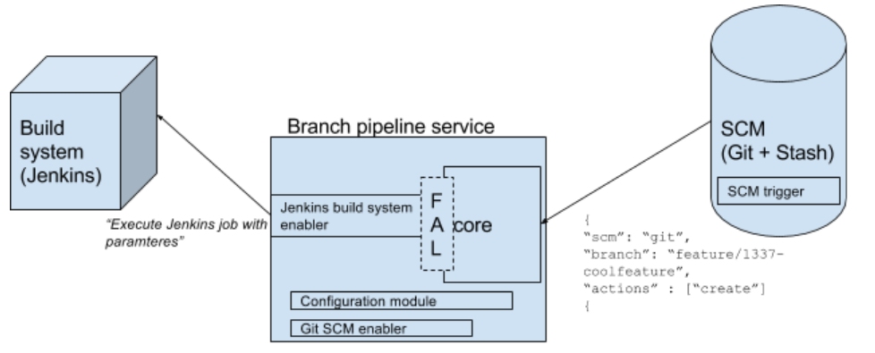

# Analysis of responsibilities and data ownership in ABP

* Which part of an automated branch pipeline setup is responsible for certain actions?
* Which part of such an system would naturally hold the data and information needed, especially configuration of such a system?
* Where are data or events naturally available?
* Are there any expected restrictions in parts of the system with regards to what workflow or tasks could be executed there?

Have in mind the overall existing architectural drawing show below:

## Assumptions

There are some assumptions we have in the following:

* We always use push work flows, not pull. E.g we will always prefer the owner of an event to tell subscribers event happening, rather than subscribers to continuously pull information to see if an interesting event happened.

## Events

### SCM have the primary event 

The automation in automated branch pipelines all stems from branch creation or deletion in the SCM. That is the primary event.
The only true source for the event is the SCM.

### The build system have no events

Even though the build system triggers on commits, probably also on the branches managed by this system, those events are not related to automated branch pipeline. Nothing should happen in that sense.

If the build system description changes of the project build pipeline, it should not change the branch pipelines either. Just like the source code, those stays like when the developers branched off mainline.

## Data

### SCM have branch information and event type

The event type, either _create_ or _delete_ branch is known by the SCM only. Further also the branch name stems from the SCM.

### Build pipeline description is outside ABP

The build pipeline description, basically all the build jobs as code and their relation, belong to the project itself. Usually it would be version controlled with the project's source code, or at least under version control.
This means it is out of scope of the components in ABP, but have to be read or fed into ABP as configuration to be available.

_Currently this is solved by assuming the build system have access to the description_, but it could be reconsidered. In the POC it works because a Jenkins job using Job DSL is executed.

### Projects own their own ABP configuration file

Each project should maintain their own configuration how they want to utilize automated branch pipeline.

Configuration options should include:

* branch name conventions - which branches should have an automated branch pipeline setup
* a configured way of triggering that the build system creates a build pipeline
* a subset of jobs from the ordinary build pipeline, to use for that specific branch name

## Displaced or unplaced data

In the current implementation the build system owns the data about how to create the build pipeline, because the idea about the flow abstraction layer (FAL) is just an idea (currently there is to many of those out there) and not part of the first implementation.

